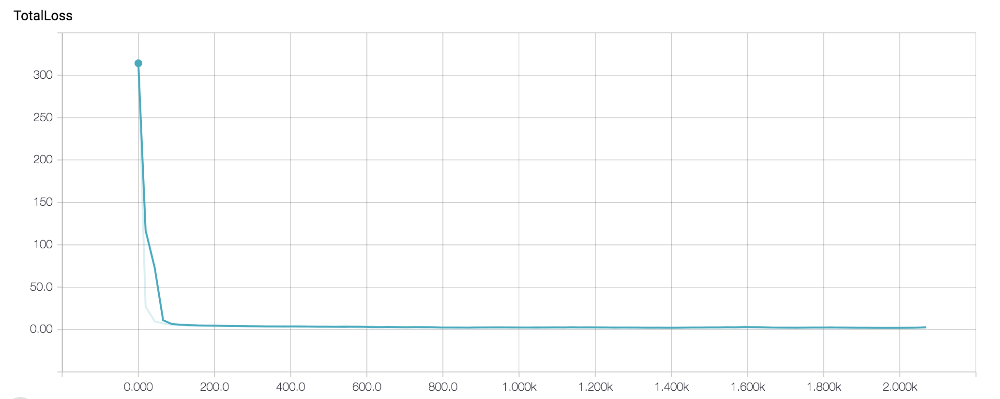
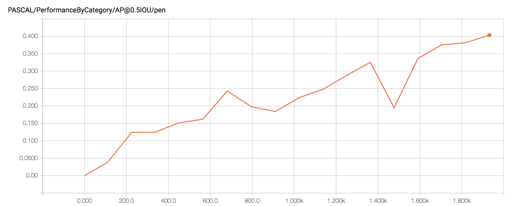

# Pens Detection with Tensorflow Object Detection API

## Overview
The goal is to understand how to train, evaluate and improve a detection model.
To do so, we are going to practice on a specific case: a pen detection problem.

It will use the very convenient [Tensorflow Object Detection API](https://github.com/tensorflow/models/tree/master/research/object_detection).  

All the steps, from image sourcing to model evaluation will be explain here.


## Requirements

* Python 3.6
* Tensorflow Object Detection API ([Steps to install here](https://github.com/tensorflow/models/blob/master/research/object_detection/g3doc/installation.md))
* Pandas: `pip install pandas`


## Image sourcing
That's a long and straightforward part. I personally used Google Images, and [pixabay.com](http://pixabay.com).
I follow few rules for the image selection:
* Avoid downloading too small image
* Avoid complex images where there are a lot of pens overlapping each other

Put all the downloaded images in the folder dataset/images for the next step.

## Renaming
It's a good practice to rename all your images to have clean names to pursuit the steps.
To do so, you can use the prepare/rename.py script.

```
python3 prepare/rename.py
```

## Resizing

To avoid some overloading RAM problems, it's better to resize large images.

```
python3 prepare/resize.py
```

You should find all your renamed images in the folder dataset/renamed-images. 

## Annotation

Here is the boring part. 
You should use a software to draw bounding box on the images around the objects you want to detect.

You can use one of them:
* [Fast Labelling Tool](https://github.com/christopher5106/FastAnnotationTool)
* [RectLabel](https://rectlabel.com)(for MacOS only)
* [LabelImg](https://github.com/tzutalin/labelImg)

In the software open the folder dataset/renamed-images and start annotate.
You should get a sub folder annotations with xml files. For the next step we need to translate this files in one CSV file.

```
python3 prepare/annotations/to_csv.py
```

Normally, you have now a new csv file called "annotations.csv" in dataset/.

## Write TFRecord files

The Tensorflow Object Detection API uses TFRecord files as data input. 
This step consists to the translation of all our images and theirs annotations to two TFRecord files: one for the training part and another for the evaluation process.

```
python3 prepare/tfrecord.py
```

Now you should have two new files:
* data/train/train.record containing 80% of your dataset to train your model
* data/eval/eval.record containing 20% of your dataset to evaluate your model

## Training

### Create the label map

First, create the file data/label_map.pbtxt that contains the following lines:
```
item {
  id: 1
  name: 'pen'
}
``` 
Make sure you start the id at 1, and increment as you need.

### Choose a model

To avoid days of training we are going to use one of the detection pre-trained models that the Object Detection API provides us.
See [here](https://github.com/tensorflow/models/blob/master/research/object_detection/g3doc/detection_model_zoo.md), to see all the available architectures.
Choose one model and download it. Unzip it. In this folder we need three files:
* model.ckpt.data-00000-of-00001
* model.ckpt.meta
* model.ckpt.index

This three files represent a saved state of the pre-trained model. 

Copy them to model/train

### Configuration

We need then a config file corresponding to the model's architecture and the training settings. Go [here](https://github.com/tensorflow/models/tree/master/research/object_detection/samples/configs) and download the config file that matches your chosen model.

You need to open that file and change all occurrences of "PATH_TO_BE_CONFIGURED".

For instance, according to our project file tree, "train_input_reader" object should look like this:

```
train_input_reader: {
  tf_record_input_reader {
    input_path: "data/train/train.record"
  }
  label_map_path: "data/label_map.pbtxt"
}
``` 

### Start the training

Run the following command to start the training:
```
python PATH_TO_OBJECT_DETECTION_FOLDER/models/research/object_detection/train.py --logtostderr --pipeline_config_path=model/train/YOUR_CONFIG_FILE
ig --train_dir=model/train
```
Note that, the command runs for unlimited number of epochs (one epoch = the whole dataset going through the network once).

At certain time, the training program saves the state of the learning with the same 3 files as above (model.ckpt-50...). 
So, if you stop the learning and restart it , it would restore the last checkpoint.

### Monitor the training on Tensorboard

To monitor the training run this:
```
tensorboard --logdir=model
```

Visit [localhost:6006](http://localhost:6006) to see how your training goes. There is a lot of graphs and variables you can observe. I recommend to follow the Total Loss value in the scalars tab.
Make sure this value is decreasing. If the training goes well, it should look like this:



### Evaluation

In another terminal, during the learning you can observe how goes your model on the eval dataset.
Run the following command to start the evaluation:
```
python3 PATH_TO_OBJECT_DETECTION_FOLDER/models/research/object_detection/eval.py --logtostderr --pipeline_config_path=model/train/YOUR_CONFIG_FILE
g --eval_dir=model/eval --checkpoint_dir=model/train
```
Note that, the command prints nothing, it creates output file in the folder model/eval. To see the results of the evaluation go on your Tensorboard. 
A new scalar should appears, it's called PASCAL. The graphs show the mean Average Precision calculated as described in the PASCAL VOC Challenge.
Without going into details, it evaluates the precision of your model, the higher is the bette.

The value should increase over the steps (epochs).



### Export the model

Once you got the result on the evaluation set you want, you can stop the training and the evaluation processes.
To use your model you need to export it to a Tensorflow graph proto.

To export it, use the following command:
```
python3 PATH_TO_OBJECT_DETECTION_FOLDER/models/object_detection/export_inference_graph.py \
    --input_type image_tensor \
    --pipeline_config_path model/train/YOUR_CONFIG_FILE \
    --trained_checkpoint_prefix model/train \
    --output_directory model/output_inference_graph.pb
```

Now you should have a new file named "output_inference_graph.pb" that contains your trained model.


### Run model on images

Now that you have a Tensorflow graph proto file, you can load it and run predictions on images to see the results of your training.
Put images you want to test in data/test/. No need for annotations. Then run:

```
python3 predict.py
```
The results of the prediction should be in model/test. The results take the form of images with labelled boxes drawn on detected objects.

## Thanking

Thanks to the work of Dat Tran on [his raccoon detector](https://towardsdatascience.com/how-to-train-your-own-object-detector-with-tensorflows-object-detector-api-bec72ecfe1d9).


